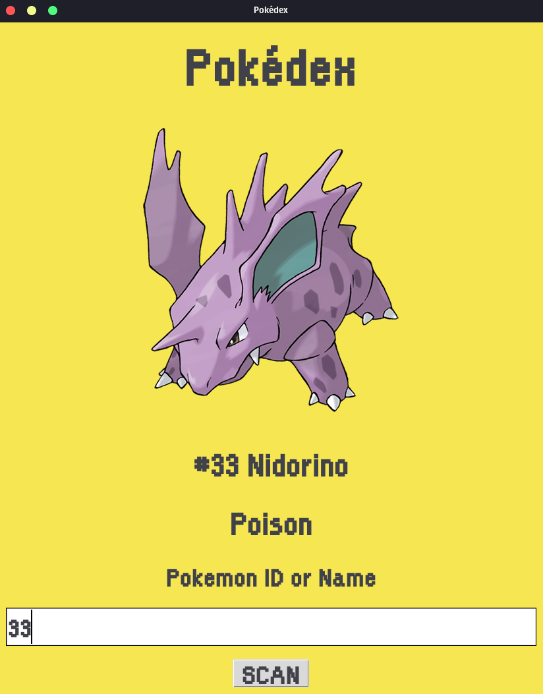

# Pokédex GUI

<table>
  <tr>
    <td></td>
    <td></td>
  </tr>
</table>

Graphical User Interface to get pokémon information using [PokéAPI](https://pokeapi.co/).

## Functions

- Create a sqlite database containing pokémon information (extracting from API).
- Create a CSV file containing pokémon information (extracting from API).
- Create a CSV file containing pokémon information (extracting from database).
- Graphical User Interface from the inputed information consulting the database using `tkinter`.

## Running
Clone this repository. With **python** and **pip** installed, install the dependencies with:
```sh
$ pip install -r requirements.txt
```
Run the application from `main.py`.

## License
This project is licensed under the MIT License - see the [LICENSE.md](https://github.com/gabriel-venezian/my-etl/blob/main/LICENSE.md) file for details.
